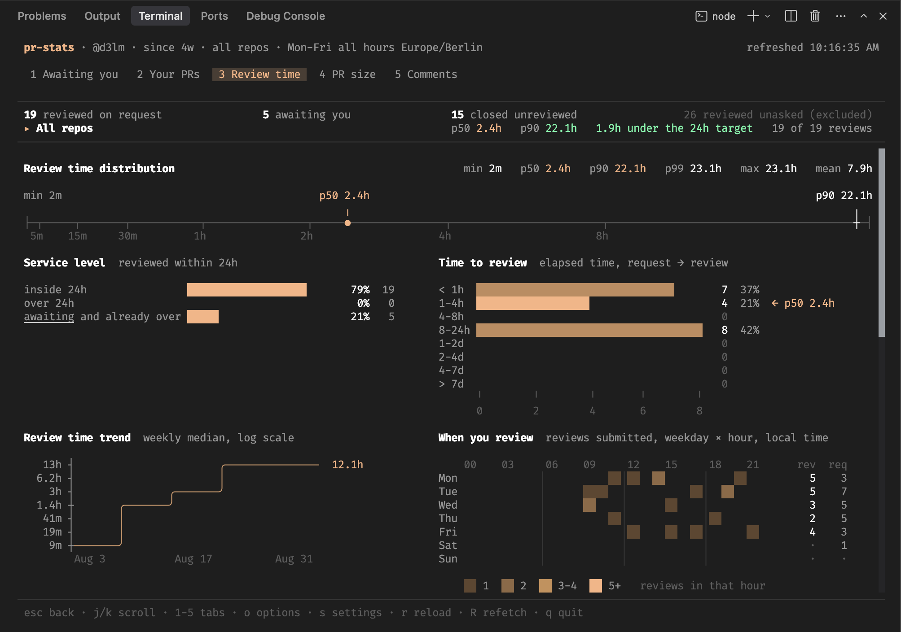

# pr-stats

An interactive terminal UI, built with [OpenTUI](https://github.com/anomalyco/opentui) and React, that shows statistics for a GitHub user, e.g., time to review, size of authored PRs, or comments received on them. It works with any repository your GitHub login can see. It has a queue tab for the open PRs on your reviewing plate, split into those awaiting your review and those you already reviewed, a Your PRs tab that splits into your open PRs and a merged-and-closed report, chart tabs for the review-time, size, and comments reports, and a live options modal.



## Requirements

The TUI renders through native FFI, so it needs either Node 26.4 or newer, or [Bun](https://bun.sh) 1.3 or newer. You also need one of two ways to authenticate:

- An authenticated gh CLI. Run `gh auth login` if you have not set that up yet.
- A GitHub access token, passed through `--token` or the `GITHUB_TOKEN` or `GH_TOKEN` environment variable. When a token is present, the tool calls the GitHub API directly and does not need the gh CLI at all. The token needs the `repo` scope to see private repositories.

## Install

```bash
npm install -g @d3lm/pr-stats
```

You can also run it without installing through `npx @d3lm/pr-stats`. The bunx equivalent is `bunx --bun @d3lm/pr-stats`, where `--bun` runs the TUI on Bun directly instead of going through Node.

## Usage

```bash
pr-stats
```

Without flags, it looks at PRs from the last 90 days across all repositories you can access. The tabs hold these views.

- The queue tab, which it opens on, shows two lists. The open PRs awaiting your review come first with how long each has been waiting, and below them sit the open PRs you already reviewed or commented on with how long ago that was, so a PR stays visible until it merges or closes. A fresh review request moves a PR from the reviewing list back into the awaiting one.
- The Your PRs tab has two sub-tabs, which the `t` key switches. The first lists your own authored PRs that are still open with their age and size. The second reports how your authored PRs got created, merged, and closed, telling a merge apart from a close without one. It charts time-to-merge percentiles, a histogram and trend, a merge-time heatmap, and a scatter of merge time against PR size. It also measures how long your PRs wait for their first review from someone else, with a histogram and trend of the time from creation to that review and a histogram of how long the open PRs still without one have waited. It also plots a merge-rate trend over the concluded PRs, cumulative created and merged lines whose gap shows the backlog, weekly created and merged volumes, an outcome gauge, and the most recently merged and closed PRs. A reviewer leaderboard ranks who reviews your PRs by distinct PRs reviewed, and a review-coverage gauge counts the merged PRs that never received a review. Your own replies to review threads never count as a review for any of them.
- The time-to-review report pairs its histogram, trend, heatmap, and weekly volume with a scatter of review time against PR size, the completed review cycles per PR, and a verdict gauge splitting approvals from change requests. It also shows the age of the requests still waiting on you, how old PRs already were when the request reached you, and an off-hours gauge that splits weekdays into work hours and after hours once `--work-hours` is set. On the aggregate view it additionally compares median review times by repo.
- The PR size report carries the same histogram, trend, heatmap, and weekly volume for PR sizes and adds a net-lines trend that sums additions minus deletions per week.
- The comments report holds a histogram of comments per PR, a scatter of comments against PR size, and the most commented PRs.

When the data spans multiple repos, every tab opens on a repo picker that drills into one repo or the aggregate across all of them, and on the two queue lists the `g` key groups the aggregate list by repo. Comparison cards like the reviewer leaderboard cap themselves at eight rows and fold the rest into an overflow line, and the `x` key lifts the cap on the open stats tab and restores it. The footer names the key whenever the tab has a capped card.

Node gates the FFI that OpenTUI renders through behind the `--experimental-ffi` flag, and the launcher re-executes itself with that flag when it is missing, so a plain `pr-stats` works without extra flags on both runtimes.

All flags pre-seed the options modal:

```bash
# Limit the search to one repository and a start date
pr-stats --repo owner/name --since 2026-01-01

# Report how many reviews finished within one working day
pr-stats --work-hours 9-17 --target 1d

# Report how many authored PRs stayed under 400 changed lines
pr-stats --size-target 400

# Authenticate with an access token instead of the gh CLI
pr-stats --token your-access-token
```

Run `pr-stats --help` for the full list of options.

## JSON export

The `--json` flag prints every stat as JSON to stdout instead of starting the TUI, so the output pipes into jq or lands in a file through a redirect. Every other flag applies to the report the same way it seeds the TUI, and load progress renders on stderr, so a piped stdout stays pure JSON.

```bash
pr-stats --json | jq '.review.reviewTimeHours'
```

The report carries the same data the tabs derive. The `review` object holds the counts, the review-time summary, the verdicts, the per-repo medians, the optional target gauge, and one entry per completed, pending, and reviewing cycle. The `authored` object holds the outcome counts, the size, merge-time, and first-review summaries, the optional size-target gauge, the reviewer leaderboard with the review coverage, and one entry per authored PR with its size, comment counts, reviewers, and merge, close, and first-review times. The `comments` object summarizes the comments per PR. Summaries report the count, mean, p50, p90, min, and max, and every duration respects the configured time mode, so a working-hours setup reports counted hours instead of wall-clock hours.

The settings dialog has an export row that writes the same report to `pr-stats.json` in the directory pr-stats was started from, built from the data currently on screen and the live options.

## Caching

The expensive part of a run is fetching the per-PR review timelines and the size and comment counters, so those get cached on disk per PR. Only closed and merged PRs are cached, because their timelines and sizes no longer change. The searches and every open PR are fetched fresh on each run, which keeps the results correct while skipping most of the API calls after the first run.

The login of the authenticated user is cached for a day as well, which skips one round trip per run. A configured `--user` never touches that cache. The TUI additionally snapshots the last successful load, and a later start with the same data options renders the snapshot instantly while the real load refreshes it in the background. A narrower `--since` window also hits the snapshot, because the subset gets cut from it by PR creation date.

The cache lives in `~/Library/Caches/pr-stats` on macOS and in `$XDG_CACHE_HOME/pr-stats` or `~/.cache/pr-stats` elsewhere. The `PR_STATS_CACHE_DIR` environment variable overrides the location. Pass `--no-cache` to skip every cache read, which refetches everything, including the login, and rewrites the cache with fresh data. Runs with `--debug` never read or write the cache, so canned test data stays out of it.

The options modal can also save the current options to the cache directory with the `s` key. Later runs start from the saved options wherever no flag was given, and flags on the command line always take precedence. The modal labels whether the current options match the saved ones, and clearing the cache from the settings dialog keeps the saved options.

The settings dialog can also disable the cache permanently. The toggle persists to `settings.json` in the cache directory, so every later run refetches everything the way `--no-cache` does. An explicit `--no-cache` flag always wins over the saved setting. The same dialog switches the color theme, described under Theming below. The dialog can also reset the settings, which deletes `settings.json` together with a saved theme, so future runs start from the defaults.

## Theming

The TUI ships five built-in themes, the warm amber default plus green, blue, purple, and yellow variants. Each variant recolors the accent and chart colors at the same saturation and lightness as the default, so every theme keeps the same contrast, while the neutral text and background grays stay shared. The Theme row in the settings dialog cycles through them with the arrow keys and applies the choice immediately.

The Edit colors row below it opens a list of every theme color with its current hex value. Enter edits the selected color in place, and a committed value applies immediately. The first edit creates a custom theme that starts from the built-in theme on screen, and the Theme row switches to `custom`. Further edits refine the custom theme, and an empty value returns a color to the built-in the custom theme started from. Clearing the last custom color dissolves the custom theme back into that built-in.

The custom theme joins the Theme row cycle as a sixth entry and persists across switches, so picking a built-in theme renders it pure while the custom colors stay saved, and cycling back to `custom` restores them. Everything lands in a `theme` object in `settings.json` in the cache directory, which you can also edit by hand:

```json
{
  "theme": {
    "preset": "custom",
    "base": "blue",
    "accent": "#89b4f0",
    "heat": ["#32475c", "#49688a", "#5f92c0", "#89b4f0"]
  }
}
```

The `preset` key names the active theme, one of `default`, `green`, `blue`, `purple`, `yellow`, and `custom`. The `base` key names the built-in theme the custom colors start from and defaults to `default`, and every other key sets one custom color on top of that base. The color keys are `bg`, `border`, `text`, `muted`, `dim`, `accent`, `selectedBg`, `inputBg`, `inputFocusedBg`, `warn`, `error`, `success`, `chartBar`, `chartLine`, `chartDim`, and `heat`. The `heat` key colors the weekly heatmap and takes four colors from cool to hot. A file that sets colors without a `preset` activates the custom theme they define, and a `custom` preset without any colors falls back to its `base` theme. A typo in a key or a color fails the start with a message naming the mistake, so a broken theme never renders.

## Development

The TUI runs with `bun tui/main.tsx`. To try it under Node instead, run `pnpm tui:node`, which rebuilds the bundles and starts the built launcher from `dist/`. The entry point accepts `--debug <path>` with a path to a testdata directory, for example `bun tui/main.tsx --debug tui/testdata`, which serves canned data from the fake `gh` binary in that directory instead of fetching from GitHub. The TUI has a test that drives the whole pipeline against the same fake binary, which `bun test tui` runs. `pnpm build` bundles the binary into `dist/`, where `tui.mjs` is the runtime launcher and `tui-app.mjs` is the app bundle it loads.
